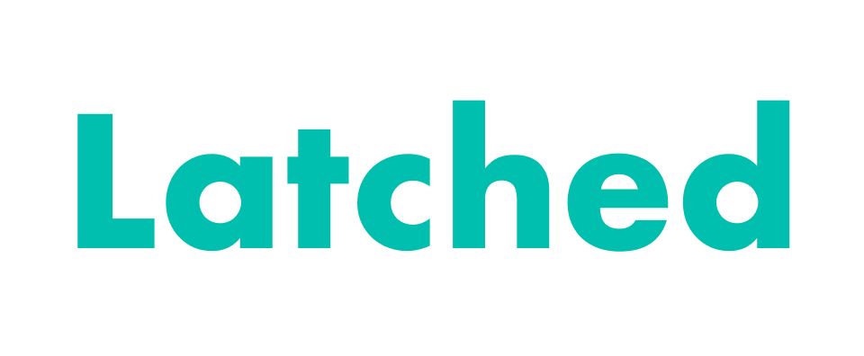

<p align="center">
    
</p>

<p align="center">
    <!-- <a href="https://discord.gg/UxMXBHUWcr"></a> -->
    <a href="https://github.com/TBD-Labs-AI/latched/issues"></a>
    <a href="https://github.com/TBD-Labs-AI/latched/blob/main/LICENSE"></a>
    <a href="https://www.latched.ai"></a>
</p>
<p align="center">
    
    
    
</p>

<h3 align="center">
ML models latches onto devices
</h3>

Latched provides easy-to-use pipelines to perform ML models on various devices such as mobile, Nvidia jetson, Intel CPUs,  and accelerators.
Latched covers both converting models and deploying them(Latched Model Manager, Latched Devices SDKs).

## 📦 Installation

1. Clone the repository
    ```bash
    git clone https://github.com/TBD-Labs-AI/latched.git
    cd latched
    ```
2. Make the virtual environment with `Python 3.11.9` and activate it.
    ```bash
    conda create -n latched python=3.11.9
    conda activate latched
    ```
3. Install the dependencies with Poetry
    ```bash
    pip install poetry
    poetry install
    ```
4. Launch the test script (onnx export)
    ```bash
    python examples/llama-3.1-8B-Instruct-to-onnx/llama_onnx_example.py
    ```


## 🤖 Supported ML Tasks

📚 Text:

- Small Language Models, to embed chat-bot or text analysis on device
  - **Phi 3.5 mini** + OmniQuantW3A16 @ iPhone 15 Pro (coming soon)
  - Other models will be supported soon
- Other tasks will be supported soon

🏞️ VIsion:

- Object Detection (coming soon)
- Image Classification (coming soon)
- Other tasks will be supported soon

🗣️ Audio:

- Speech to Text, Automatic Speech Recognition (coming soon)
- Other tasks will be supported soon


Supported Frameworks:

- [PyTorch](https://pytorch.org/)
- [Hugging Face](https://huggingface.co/)

## 🧩 Latched Components

<!-- Put some Diagram here -->

**Latched**: Latched python library provides hardware-aware optimization. With this library, you can export your ML model into hardware-optimized forms.

**Latched Model Manager**: Latched model manager provides a RESTful API to register and run ML models on various devices.

**Latched Devices SDKs**: Latched devices SDKs provide libraries to run ML models on various devices.

## 🚀 Getting Started

### Installation

coming soon

### How to use Latched

1. Optimize Model
   ```python
   # Code will be updated soon
   from latched import AutoModelOptimizer
   ...
   ```
2. Export Model
   ```python
   # Code will be updated soon
   ```
3. Register Model to Model Manager
   ```python
   # Code will be updated soon
   ```
4. Run model on device (swift version)
   ```swift
   // Code will be updated soon
   import Latched
   let model = LatchedModel(key: "model_key")
   ```

## 📚 Model Hub

coming soon

## Contributing

Do you believe the future of AI is on edge computing? Do you want to make it happen?
Join Latched as a contributor!
If you want to contribute to Latched, please read the [CONTRIBUTING.md](CONTRIBUTING.md) file.

## 📅 Milestones

### SEP 2024
- [ ] Optimize Phi 3.5 mini model
  - [ ] Export Phi 3.5 mini model to
    - [ ] CoreML
    - [ ] TensorFlow Lite
    - [ ] TensorRT
    - [ ] OpenVINO
    - [ ] ONNX
  - [ ] Optimize Phi 3.5 mini model to
    - [ ] Apple iPhone 15 Pro
    - [ ] Samsung Galaxy S24
    - [ ] Nvidia Jetson
    - [ ] Intel CPU
    - [ ] Intel Gaudi2
    - [ ] Rebellion ATOM
    - [ ] AWS Inferentia
- [ ] Register Phi 3.5 mini model to Model Manager
- [ ] Create Swift example code to run
  - [ ] Phi 3.5 mini model on Apple iPhone 15 Pro
  - [ ] Phi 3.5 mini model on Samsung Galaxy S24
  - [ ] Phi 3.5 mini model on Nvidia Jetson
  - [ ] Phi 3.5 mini model on Intel CPU
  - [ ] Phi 3.5 mini model on Intel Gaudi2
  - [ ] Phi 3.5 mini model on Rebellion ATOM
  - [ ] Phi 3.5 mini model on AWS Inferentia
- [ ] Release Benchmark Dashboard of Phi 3.5 mini model on each devices
## 🤝 Acknowledgements

This repository uses the following third-party libraries:

- [PyTorch](https://pytorch.org/)
- [Hugging Face](https://huggingface.co/)
